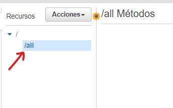
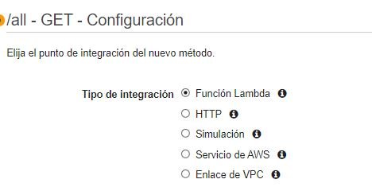
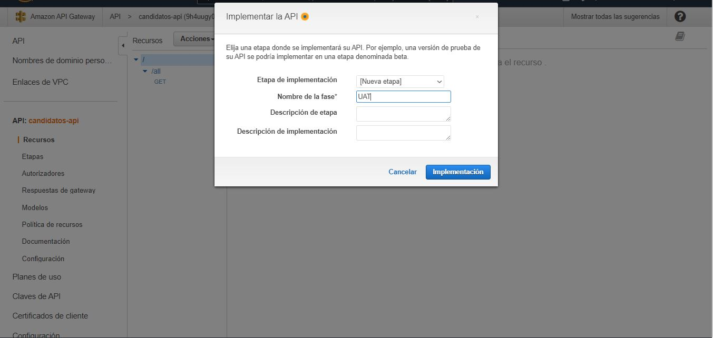

# Práctica desarrollo web (AWS)

### 1. Back-end 

Empezaré desarrollando la parte del back-end usando AWS **(DynamoBD, Lambda y API Gateway)**

Primero hay que crear una cuenta en AWS Usando este 
[link](https://portal.aws.amazon.com/billing/signup?refid=ps_a134p000003yhp0aai&trkcampaign=acq_paid_search_brand&redirect_url=https%3A%2F%2Faws.amazon.com%2Fregistration-confirmation&language=es_es#/start)

```markdown
Una vez creada la cuenta, accedemos a la misma y veremos la siguiente ventana:
```


### Creación de una Tabla en DynamoDB

Teclamos DynamoDB y seleccionamos la primer opción.


Tendremos la siguiente pestaña:


Ahora presionamos el botón de ***crear tabla***. 

Al presionar el botón nos aparecerán los detalles de la tabla.


En mi caso yo ingresé los valores de 

```markdown
1. Nombre de la tabla:
    Candidatos
2. Clave de partición: 
    id : número.

Y los datos posteriores los omitimos.
```
Por ultimo, presionamos ***Crear Tabla***

Una vez creada nos aparecerán las tablas dentro de DynamoDB, y podemos observar que nuestra tabla ***Candidatos*** se creo correctamente.


Ahora entraremos a ver más detalles de la tabla, presionando la liga con el nombre de la misma.


Aquí es donde podremos ver lo siguiente.

```markdown
> Información general
> Índices 
> Monitorear la tabla
> Copias de seguridad 
> Etc.
```


Ahora ya teniendo la tabla, comenzaremos a crear funciones lambda para hacer modificaciones en la misma.

### Creación de funciones Lambda

En el buscador teclearemos ***lambda*** y seleccionamos la primer opción. 


Ahora nos aparecerán las opciones para funciones **Lambda**, Presionamos el botón ***Crear una función***


Ahora nos aparecerán las opciones para crear una nueva función. 

En mi caso solo ingresé el nombre de la función y lo demás lo deje tal cual estaba. 

```markdown
Nombre de la funcion: getCandidatos
```


Presionamos el botón ***Crear una función*** y esperamos.


Una vez lista la función, se nos mostrará información de la misma.


Dentro de la sección de **Código fuente** es donde podremos hacer algunos procesos para obtener datos de **DynamoDB**. 

Por ejemplo el siguiente código nos regresa todos los datos dentro de la tabla ***Candidatos***

```javascript
'use strict';
//importamos el sdk de aws
const AWS = require('aws-sdk')

//Creamos un cliente para acceder a DynamoDB, le pasamos como parametro la region en la que nos encontramos
const docClient = new AWS.DynamoDB.DocumentClient({region: "us-east-2"})

//Dentro de exports.handler podemos hacer todas las peticiones a la tabla. 
exports.handler= (e, cta, callback)=> {

    //Los parametros contienen datos que necesitan las peticiones.
    var params = {
        TableName : 'Candidatos'
    }
   /*Hacemos "Scan" de la tabla para obtener todos los datos, si tenemos un error lo regresamos, 
   en caso contrario, regresamos los datos obtenidos de la tabla.*/
   docClient.scan(params,  function(err, data) {
   if (err) 
       //Regresamos un error
        callback(err, null);
   else 
       //Regresamos los datos
        callback(null,data.Items);
   });
};
```
Nota: Hacemos click en la opción de region (que en mi caso es **Ohio**) y asi obtenemos el código de region para el cliente.


Para probar que efectivamente nos regresa todos los valores dentro de la tabla, haremos un test, al cual le asignamos un nuevo nombre y le pasamos los datos necesarios.
Guardamos los cambios, esto lo hacemos dando click en **Deploy**, y presionamos ***Test***


Al pricipio obtendremos un error, ya que el rol (que por defecto se creo cuando definimos la funcion) no tiene acceso a DynamoDB.


Por lo que tenemos que darle permiso a este rol.

Nos dirigimos a la sección de Configuración > Permisos 


y damos click en la liga del nombre de rol.

Al hacer esto se nos abrirá una nueva pestaña y en ella veremos el panel de ***Identity and Access Management (IAM)*** y se nos colocará en la sección de roles. 

Por lo que seremos capaces de ver el resumen del rol. en mi caso ***getCandidatos-role-8j6nberw***


Dentro de la sección de Resumen presionamos el botón **Asociar Políticas**


Después nos aparecerá un buscador, en el cual teclearemos Dynamo y seleccionamos  

```markdown
> AmazonDynamoDBFullAccess
```


Y presionamos el botón ***Asociar Política***

Ahora podemos observar que la política se asoció correctamente. 


Si regresamos a la sección del código fuente y hacemos un test podremos ver lo que tenemos en la base de datos. 


```markdown
En mi caso aún no tengo datos.
```

Ahora lo que tenemos es que hacer es consumir los datos desde una API, para eso usaremos el servicio API Gateway. Tecleamos API en el buscador y seleccionamos API Gateway


Veremos una pestaña con la siguiente información.

Hacemos scroll hacia abajo y buscamos la opcion **API REST** (no privada)


Presionamos ***Crear***


Tendremos algunas configuraciones previas a la creación de la API. 


```markdown
> Nuestro Portocolo será de tipo:  REST 
> Seleccionamos la opcion: API nueva
```


Ingresamos el nombre de la API 


En mi caso ***candidatos-api***.

Presionamos ***Crear API***.

Por lo que veremos el panel de Métodos y algunas otras configuraciones.


Ahora presionamos el botón ***Acciones***


Seleccionamos **Crear Recurso**


Este recurso tendrá como nombre ***all***.

Presionamos el botón ***Crear Recurso*** y podrémos observar que ahora el recurso all se encuentra en la sección para recursos.



Lo seleccionamos y presionamos el botón de acciones.


Seleccionamos la opcion de ***Crear método***, y del menú desplegable seleccionamos **GET** y presionamos el icono de check


Al presionar el botón de check, veremos la configuración del método.

```markdown
Seleccionamos en Tipo de integración: Función Lambda
```



```markdown
En Función Lambda escribimos el nombre de la función que creamos anteriormente 

En este caso:  getCandidatos 
```


Presionamos el botón de ***Guardar***


Aceptamos conceder permiso a API Gateway para invocar la función Lambda. Y así tendremos nuestro primer endpoint de la api, y de hecho podremos ver como es que se ejecutará este método.


Para hace runa prueba presionamos el botón de ***PRUEBA***


Como no tenemos cosas que mandar simplemente presionamos el botón ***Pruebas***


Y obtendremos respuesta de la consulta a DynamoDB usando funciones lambda y desde un endpoint.


Haremos un deploy de la API. presionamos la raíz de los recursos y presionamos el botón de ***Acciones***


Y seleccionamos **Implementar API**


```markdown
Ingresamos en etapa de implementación: [nueva etapa]
y en nombre de la fase el nombre cualquier cosa, por ejemplo: UAT
```


Y presionamos el botón ***Implementación***


Ahora podremos invocar la url para probar el endpoint, agregando el recurso que creamos (***/all***)

 https://9h4uugy0hj.execute-api.us-east-2.amazonaws.com/UAT/all

 Si probamos con postman, obtendremos la siguiente información, la cual es correcta, y nos dice que el endpoint funciona! Ahora tendremos que realizar un endpoint para editar las habilidades de un Candidato.

 

 Los pasos son prácticamente los mismos, solo hay que crear nuevas funciones lambda con diferentes acciones.

 ### Con el siguiente código podemos actualizar las habilidades de un Candidato

 ```javascript
 
var AWS = require("aws-sdk");
var docClient = new AWS.DynamoDB.DocumentClient()
exports.handler =  (event, context, callback) => {

    const params = {
        TableName : "Candidatos",
        Key : {
            'id' : event.id
        },
        UpdateExpression: "set java = :j, elastic = :e, microservicios = :m",
        ExpressionAttributeValues:{
            ":j":event.java,
            ":e":event.elastic,
            ":m":event.microservicios
        },
        ReturnValues:"UPDATED_NEW"
    }
    
    docClient.update(params, function(err, data) {
        if (err){
            callback(err,null)
        }else{
            callback(null, data)
        }
    })
};
 ```
 Agregamos un nuevo endpoint a nuestra API, el cual será, de tipo PATCH (ya que estamos modificando parcialmente el índice)

 

 Implementamos este recurso en la API y consultamos mediante el url resultante.

 https://9h4uugy0hj.execute-api.us-east-2.amazonaws.com/UAT/update

 

 En esta petición pasamos dentro del body un json con los datos del Candidato, ya con modificaciones, en este caso yo cambié la las habilidades elastic y microservicios a true y la respuesta fue un json con los atributos que fueron cambiados, es decir que en un principio todos tenían un valor de false. 

 Ahora podemos pasar a desarrollar la parte del Front-end.

 ### 2. Front-end

 Para desarrollar la parte del Front-end usaré el framework Angular.

 Es necesario tener instalado node js y AngularCLI

 Usar este link para instalar [node js](https://nodejs.org/es/)

 Una vez instaldo node js instalaremos angular desde una terminal con el comando:

 ```markdown
 > npm install -g @angular/cli
 ```

 Ahora desde una terminal ingresaremos el siguiente comando, el cual nos servirá para crear un nuevo proyecto de Angular: 

 ```
 > ng new candidatos
 
 //Candidatos es el nombre del proyecto, usted puede poner cualquier otro.
 ```

 

 presionamos ***y***

 

 y seleccionamos CSS

 Ahora instalaremos algunas dependencias y las incluiremos en el proyecto.

 instalamos bootstrap y jquery con el siguiente comando: 

 ```markdown
 npm i bootstrap jquery
 ```

Ahora nos dirigimos al archivo ***angular.json*** y dentro de la propiedad **build** modificaremos styles y scripts con los siguientes datos:

```json
"styles": [
          "src/styles.css",
          "node_modules/bootstrap/dist/css/bootstrap.min.css"
          ],
"scripts": [
          "node_modules/jquery/dist/jquery.min.js",
          "node_modules/bootstrap/dist/js/bootstrap.min.js"
          ]
```

 #### Estructura del proyecto

 

 Tenemos que crear 3 carpetas dentro de **app**

 

 ```markdown
 
 _models -> aquí tendremos todos nuestros modelos para "parsear" los datos obtenidos de la API.
 
 _services -> aquí tendremos conexiones con la API y podremos hacer peticiones.
 
 components -> aquí tendremos las vistas y la lógica de las mismas.
 
 ```

Crearemos los componentes cada uno con el siguiente comando :

```markdown
ng generate component candidatos
```
 

Se crearán 4 archivos y se actualizará otro, este último nos ayuda a poder acceder a los componentes y utilizarlos con el selector **< app-nombre del componente > < /app-nombre del componente>**.

Agregaré otros componentes para ayudar al usuario a tener una forma de navegar entre vistas.

```markdown
Un componente para la información de cada Candidato.

Un componente para tener una barra de tareas fija.

Un componente para tener un footer fijo.
```

 

 Una vez lista la configuración del nuevo proyecto, hacemos **cd candidatos** e ingresaremos el siguiente comando: 

 ```markdown
 > npm start
 ```
 Este comando sirve para iniciar el proyecto y leer todas las modificaciones de los archivos dentro y fuera de la carpeta **src** 

Ahora, angular nos proveerá un Live Development Server, que estará escuchando en localhost:4200
Abrimos http://localhost:4200/ y ahí podremos ver la pagina html que angular ha creado. Pero eso a nosotros no nos sirve por lo que tendremos que modificarla y agregar unas rutas para las vistas que necesitemos (estas vistas las encontramos en los componentes).

 ```markdown
 Borramos todo lo que este dentro del archivo 
 > app.component.html
 
 y agregamos este selector: 
 
 > <router-outlet></router-outlet>
 
 Este selector nos dará permiso de usar rutas que definiremos en el archivo 
 
 > app-routing.module.ts
 ```

 Dentro del archivo **app-routing.module.ts** definimos las rutas de cada componente dentro de routes con el formato 

```json
{path: '<ruta>', component: <NombreDelComponente>}
```

 

 En este caso solo tendremos 2 opciones de vistas, una para los candidatos y otra para un candidato en especifico.

 Guardamos los cambios y nos dirigimos al navegador, y lo primero que podremos ver será que efectivamente en la ruta ' ' tenemos los elementos del componente para los candidatos

 

 y en la ruta 'info' tendremos la información de un candidato en especifico 

 

 Ahora hay que dar estilo y obtener datos de la API.

 #### Crear Servicios para obtener datos de la API.

 Detenemos el proyecto con Ctrl+c, para generar archivos y asi poder hacer uso de nuestra API.

 Primero nos dirigimos a la carpeta de **_services** desde la terminal y escribimos el siguiente comando: 

 ```markdown
 > ng generate service candidatos
 ```

 

 Se crearán 2 archivos.

 En el archivo **candidatos.service.ts**  es donde haremos las peticiones a la API.

 Ahora crearemos un modelo para hacer uso de objetos.

 Nos dirigimos a la carpeta **_models** y creamos un nuevo archivo con el nombre **candidato.ts**

 Aquí definiremos los atributos de un candidato:

 ```markdown
 id : number
 Nombre: string
 fecha_entrevista: date
 elastic: boolean
 java: boolean
 microservicios: boolean
 ```
 Así nos tiene que quedar nuestro modelo, exportamos la clase y generamos un constructor para una instancia.

 ```typescript
 export class Candidato{

    id : number 
    nombre: string
    fecha_entrevista: Date
    elastic: boolean
    java: boolean
    microservicios: boolean

  constructor(
    id: number , 
    nombre: string, 
    fecha_entrevista: Date, 
    elastic: boolean, 
    java: boolean, 
    microservicios: boolean
) {
    this.id = id
    this.nombre = nombre
    this.fecha_entrevista = fecha_entrevista
    this.elastic = elastic
    this.java = java
    this.microservicios = microservicios
  }
}
 ```

 Ahora nos dirigimos al archivo **candidatos.service.ts** para importar este modelo y algunos objetos de http para hacer peticiones.

 

 Ahora de AWS console traermos las urls de los endpoints. 

 ```markdown
 
 Para obtener todos los registros dentro de la Tabla Candidatos usamos esta url:
 * https://9h4uugy0hj.execute-api.us-east-2.amazonaws.com/UAT/all 
 
 Para hacer update de un candidato usamos esta url:
 * https://9h4uugy0hj.execute-api.us-east-2.amazonaws.com/UAT/update
 
 ```

 Definimos la url de la API y definimos los metodos para hacer las peticiones, en este caso un get y un patch.

 

Ahora trataremos de consultar los datos, usando la API. en el archivo  ***candidatos.component.ts*** importamos el modelo de Candidato y el Service de Candidatos. 

```typescript
// candidatos.component.ts

import { Component, OnInit } from '@angular/core';
import {CandidatosService} from '../../_services/candidatos.service'
import {Candidato} from '../../_models/candidato'

declare var $:any

@Component({
  selector: 'app-candidatos',
  templateUrl: './candidatos.component.html',
  styleUrls: ['./candidatos.component.css']
})
export class CandidatosComponent implements OnInit {
  /*
  En este atributo guardaremos los datos consultados de la API.
  */
  candidatos : Candidato [] | any
  /*
  Creamos un nuevo objeto de tipo CandidatosService para poder hacer uso de los 
  métodos que hacen consultas a la APi.
  */
  constructor(private candidatosService: CandidatosService) { }
    
  ngOnInit(): void {
    this.getCandidatos()
  }
  /*
  En este método llamamos al objeto candidatosService y usamos su método para obtener los candidatos desde la API.
  */
  getCandidatos(){
    this.candidatosService.getCandidatos().subscribe(
      res => {
        this.candidatos=res
      },
      err => {
        console.log("algo salio mal al consultar los candidatos")
      }
    )
  }
}
```

Al ejecutar el proyecto tendremos un error con CORS, asi que para resolverlo, crearemos un nuevo archivo en la raíz del proyecto, este tendrá el nombre de **proxy.conf.json**. 

En el agregaremos lo siguiente: 

```json
{
    "/UAT/*": {
        "target": "https://9h4uugy0hj.execute-api.us-east-2.amazonaws.com/",
        "secure": false,
        "changeOrigin": true
    }
}
```

 Al agregar esto, evitaremos el problema de CORS. (ya que queremos acceder a recursos de distintos servidores)

Ahora abrimos el archivo **package.json** y modificamos la propiedad "start" con lo siguiente: 

```json
"start": "ng serve --proxy-config proxy.conf.json",
```

Y tendremos que modificar nuestro archivo ***candidatos.service.ts*** de la siguiente manera:

```typescript
import { Injectable } from '@angular/core';
import {HttpClient, HttpHeaders} from '@angular/common/http';
import {Candidato} from '../_models/candidato'

@Injectable({
  providedIn: 'root'
})
export class CandidatosService {

  constructor(private httpClient: HttpClient) { }
    
  getCandidatos(){
    return this.httpClient.get("/UAT/all")
  }

  updateCandidato(candidato: Candidato){
    return this.httpClient.patch("/UAT/update", candidato)
  }

}
```

por lo que ahora tendremos que usar siempre el comando ***npm start*** para iniciar el proyecto.

Como ya no tenemos error con CORS, podemos ver los datos que se obtienen al consultar la API. de forma facil los podemos ver desde la consola del navegador, pero tenemos que mostrarlo en la vista de los candidatos.

 

 Abrimos el archivo **candidatos.component.html** y accedemos al atributo candidatos del archivo **candidatos.component.ts** 


Iteramos sobre el atributo y obtenemos sus propiedades, pero hay que mostrarlo con estilo, asi que lo pondre dentro de un elemento card junto con un botón, para que así podamos navegar entre vistas.

```html
<app-header></app-header>
<body>
    <h1 class="text-center">Lista de candidatos</h1>
    <div *ngFor="let candidato of candidatos">
        <div class="container">
            <div class="card">
                <div class="text-center">
                    {{candidato.nombre}} &nbsp;
                </div>
                <div class="text-center">
     <button class="btn btn-info btn-sm"> <a href="/info?id={{candidato.id}}">Detalles</a></button>
                </div>
            </div>
        </div>
    </div>
</body>
<app-footer></app-footer>
```


La vista quedaría así, ya con estilos aplicados. Podemos observar que se muestra una lista de los candidatos obtenidos de la consulta a la API. Se muestra el nombre del candidato y un botón para ver más detalles.

Este botón tiene un comportamiento similar a un hipervínculo (por lo que hay que hacer click sobre las letras),  el cual nos redireccionará a la vista de información, pasando parámetros dentro de la ruta. 

Por ejemplo para ver la información del Candidato "Jonatan" (el segundo) la ruta sería  http://localhost:4200/info?id=1, por lo que ahora ese parámetro, nos servirá para hacer una petición a la API y obtener la información por el uso del id.

Desde un principio supe que necesitaría una petición por id, solo que en un principio no la construí, ya que pensé que no seria necesaria, pero es de gran ayuda ya que en la parte del front-end no haríamos tantos cálculos. Entonces me regresaré un poco a AWS para crear otro enpoint y facilitar más las cosas.

#### Creación de endpoint  para obtener información de un candidato (por id).

Creamos una nueva función Lambda, con lo siguiente: 

```javascript
var AWS = require("aws-sdk");
exports.handler =  (event, context, callback) => {
    //con event.params.querystring.id obtenemos el parametro de la ruta. (id)
    const id =  parseInt(event.params.querystring.id,10)   
    const params = {
    TableName: "Candidatos",
    KeyConditionExpression: "id = :i",
    ExpressionAttributeValues : {
        ':i': id
    }
}
const docClient = new AWS.DynamoDB.DocumentClient({region: "us-east-2" })

docClient.query(params, function (err, data){
    if (err){
        callback(err,null)
    }else {
        callback(null,data.Items)
    }
})
    
};
```

Y agregamos las políticas de acceso a DynamoDB.

Ahora Ingresaremos al Servicio API Gateway.

Abrimos la API que construimos y crearemos un nuevo recurso.


Ingresaremos el nombre del recurso y la ruta del recurso entre { }. Creamos el recurso y creamos un método GET dentro del mismo.

Ahora damos click en el método y después en Solicitud de método.

Damos click en **Parámetros de cadenas de consulta de URL** y agregamos una cadena de consulta, esta tendrá el nombre de **id** y será obligatorio.

Cambiamos la configuración de **Validador de solicitudes** por **Validar parámetros de cadena de consulta y encabezados** y eso nos quitará ese warning.


Ahora regresamos a la sección de ejecución de método y damos click en **Solicitud de integración **, agregamos la función que creamos y después nos dirigimos a la sección de plantillas de mapeo.


En **Acceso directo de cuerpo de solicitud** seleccionamos **Cuando no haya definida ninguna plantilla (recomendado)** y en **Content-Type** application/json, ahora generamos la plantilla: 


Guardamos e implementamos la API.

Ahora podremos hacer una petición get con parámetros en la ruta, y la prodremos agregar al service para hacer peticiones a la API.


```markdown
*Nota
la ruta que definimos fue "parametro", pero en realidad a la hora de hacer peticiones esta ruta puede tomar cualquier nombre, y debe obligatoriamente añadir el parametro id.
```

Ahora regresando al front-end ya podemos hacer consultas por id, y obtener la información de un candidato en especifico.


Así se vería la vista de información de un candidato en especifico. 

En esta vista podremos:

```markdown
1. Ver información del candidato (Nombre y Habilidades)
2. Ver la fecha de entrevista
3. Modificar la información de las habilidades del candidato.
```

Cuando queramos modificar una habilidad, solo se modificara en la base de datos si presionamos el botón de Guardar.

Y cuando presionemos Guardar se nos mostrará una alerta que se obtuvo al instalar sweetalert2 (con **npm i sweetalert2**) 

 Los checkbox siempre que se guarden como marcados al acceder a la vista estos estarán marcados.


Eso seria todo para el front-end, ahora hay que desplegar le proyecto en un servidor, para acceder de manera pública. 

### Desplegar el proyecto en Heroku.

Modificamos algunas dependencias dentro del archivo package.json las copiamos de **devDependencies** y las pegamos en **dependencies** 

```
"@angular/cli": "~12.2.4",
"@angular/compiler-cli": "~12.2.0",
"typescript": "~4.3.5"
```

Agregamos lo siguiente dentro de los scripts del archivo package.json

```
"start": "node server.js --proxy-config proxy.conf.json",
"heroku-postbuild": "ng build --prod"
```

Y agregamos al final 

```json
"engines":{
        "node": "14.15.4",
        "npm": "8.1.1"
    }
//las versiones las podemos conultar en una terminal ingresando los comandos
// node -v  
// npm  -v
```

Instalamos express en el proyecto (npm i express --save)

y creamos un archivo en la raíz del proyecto, con el nombre ***Server.js*** y agergamos el siguiente código: 

```

const express = require('express');
const path = require('path');

const app = express();
app.use(express.static('./dist/candidatos'));

app.get('/*', (req, res) =>
    res.sendFile('index.html', {root: 'dist/candidatos/'}),
);
app.listen(process.env.PORT || 8080);
```

### Heroku

1. Creamos una cuenta en Heroku.

2. Accedemos 

3. Creamos una nueva aplicación 

   

Ahora regresamos al proyecto y hacermos **heroku login**, ingresamos a nuestra cuenta 

Y seguimos los pasos: 


